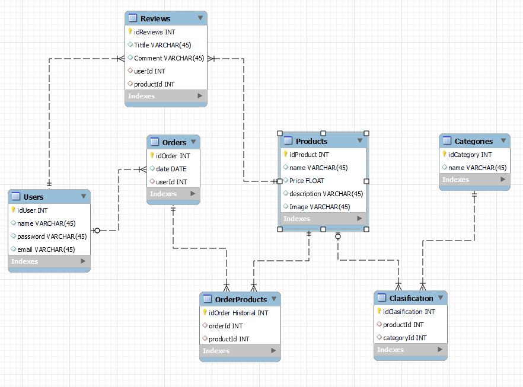
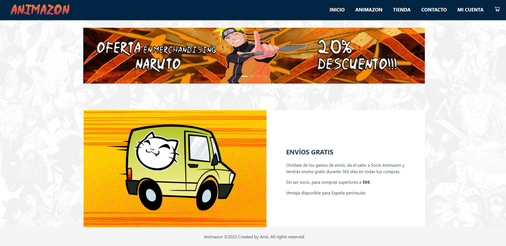
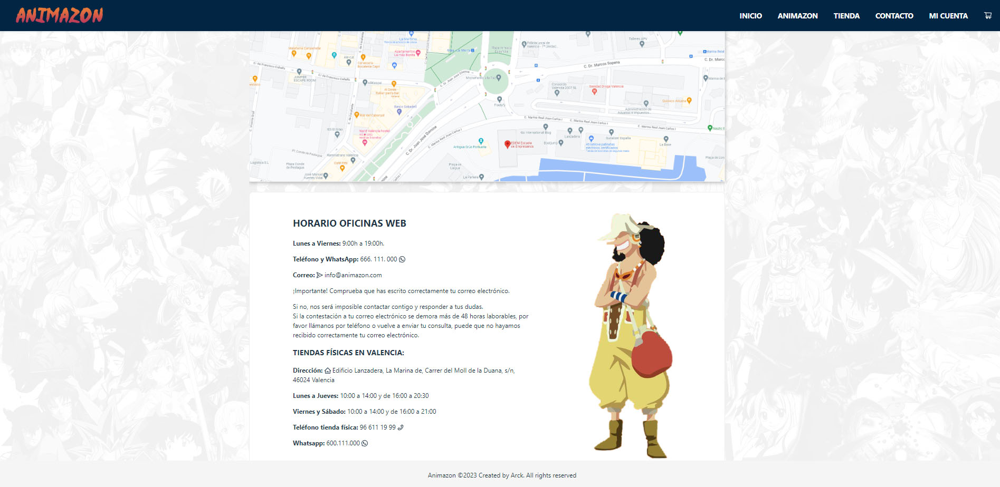
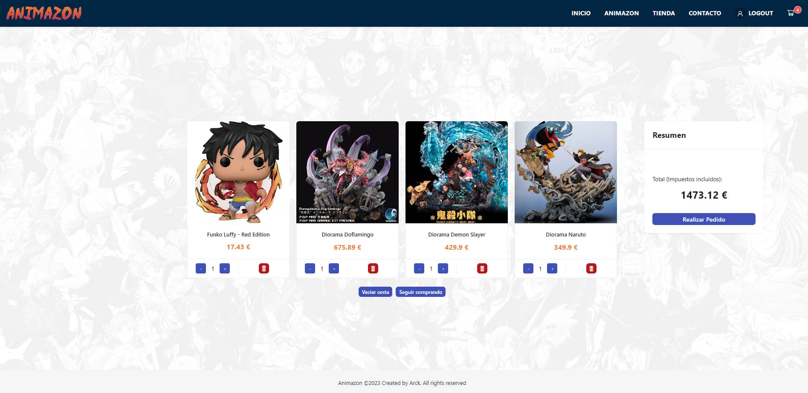
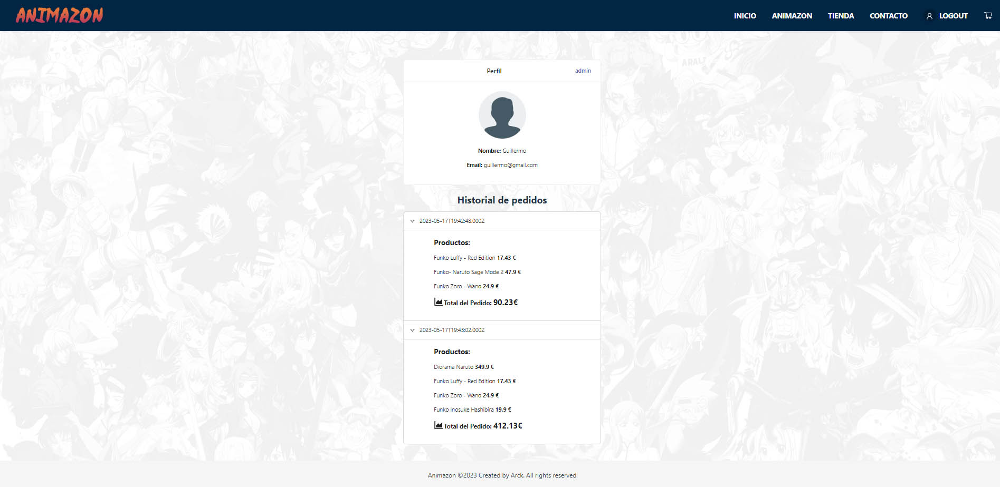
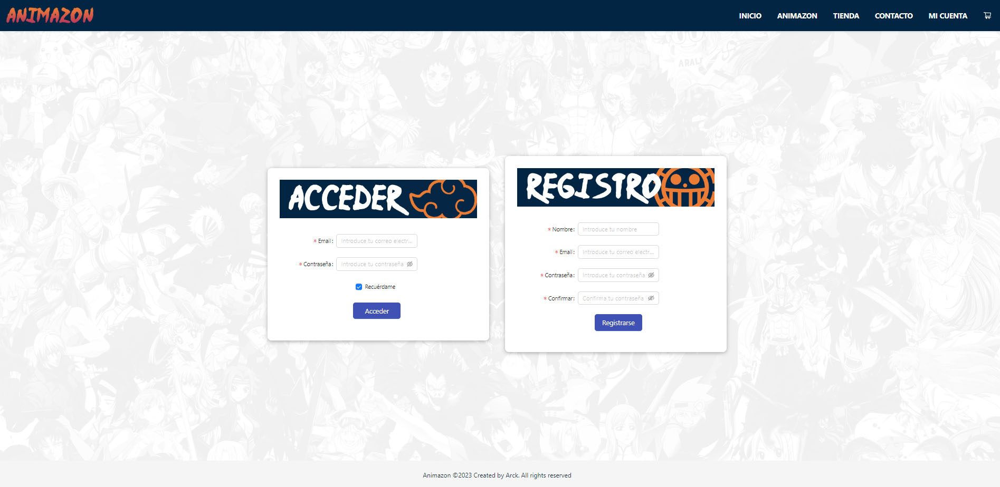
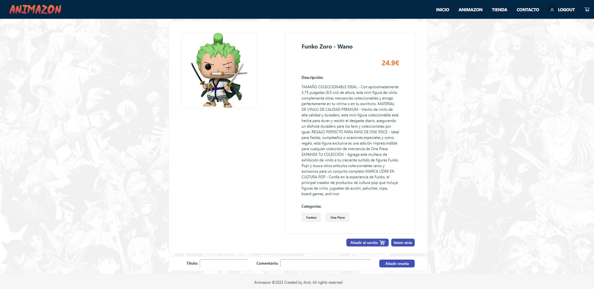
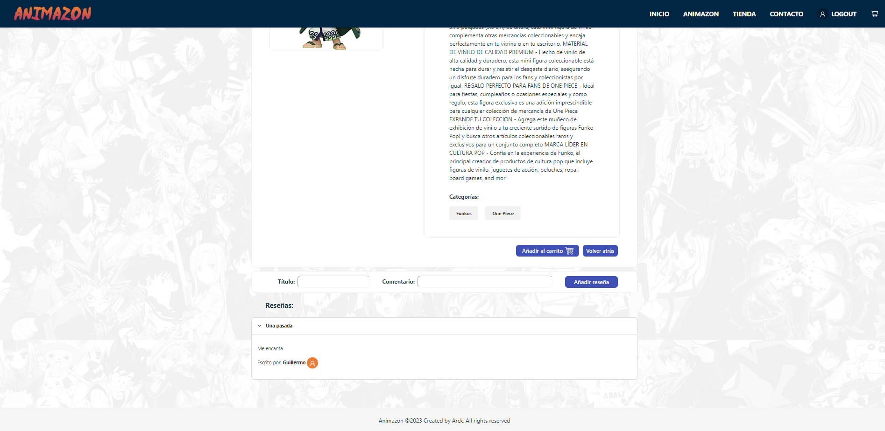

# E-COMMERCE - PROYECTO FRONTEND CON REACT

Este es un proyecto de una tienda online desarrollado con React. Proporciona una interfaz de usuario interactiva y atractiva para que los usuarios puedan explorar productos, agregarlos al carrito de compras y realizar pedidos. También podrán escribir reseñas para cada uno de ellos.

## Características principales

- Interfaz de usuario intuitiva y atractiva.
- Catálogo de productos mostrado de forma clara y organizada.
- Carrito de compras que permite agregar, eliminar y actualizar productos.
- Proceso de compra simulado para realizar pedidos.
- Proceso de registro, login y logout de usuario.
- Interfaz de administrador para crear, editar o borrar productos.
- Perfil de usuario con sus datos y pedidos.
- Reseñas de usuario.
- Gestión de estado con React Context API para una mejor escalabilidad.

En este proyecto encontramos una base de datos relacional que simula una tienda online. Los datos que almacenamos dentro de esta base de datos son:
- Usuarios.
- Órdenes.
- Productos.
- Categoría de productos.
- Reseñas.

Para poder realizarla, utilizamos un entorno de ejecución (NODE), con frameworks, ORM y junto algunos middlewares que mencionaremos más adelante.
El diagrama que representa esta base de datos es la siguiente:



## Diseño🖌️

### Index


### Animazon


### Tienda


### Contacto


### Carrito de compra


### Perfil


### Admin panel


### Acceso


### Menú individual producto


### Reseñas



## Comenzando 🚀

Para poder desplegar el proyecto correctamente, desde GitHub y con el acceso correspondiente al repositorio de la web, clonar el repositorio en su ordenador, también deberá instalar todas las herramientas, frameworks, y los middlewares para el funcionamiento correcto.

## Ejecutando React-Vite ⌨️
React es una librería de JavaScript para crear interfaces de usuario. Es una librería front-end de código abierto, basada en componentes, responsable sólo de la capa de visualización de la aplicación.

En particular, Vite React es una configuración predeterminada de Vite que está optimizada para proyectos de React. Vite React ofrece una serie de características y mejoras para mejorar la eficiencia y la velocidad de las aplicaciones de React, como la precompilación de código y la carga rápida de módulos.

En resumen, Vite React es una herramienta de desarrollo web que ofrece un sistema de compilación y servidor de desarrollo rápido y eficiente para
proyectos de React. Al usar Vite React, puedes mejorar la velocidad y la eficiencia de tus aplicaciones React y acelerar el proceso de desarrollo.

● npm create vite@latest

### Instalación React Router:
React Router es la librería de enrutamiento estándar para React.

Nos permite crear una aplicación web de una sola página con navegación sin que la página se actualice a medida que el usuario navega.

● npm install react-router-dom@6


## Ejecutando Sass ⌨️
SASS(Syntactically Awesome Style Sheets) es un preporcesador de CSS que permite usar variables, anidamiento de selectores, mixins (bloques reutilizables de código), funciones, importación de archivos y operaciones matemáticas. Estas características hacen que sea más facil, rápido y más legible escribir hojas de estilo.

● npm install sass


## Instalando Postman ⌨️
Postman es una herramienta que sirve de gran ayuda al equipo de desarrollo, permitiendo mantener las colecciones actualizadas, ahorrando los tiempos de respuesta al momento de realizar los test o las llamadas a los servicios.

Postman sirve para múltiples tareas dentro de las cuales destacaremos en esta oportunidad las siguientes:

- Testear colecciones o catálogos de APIs tanto para Frontend como para Backend.
- Organizar en carpetas, funcionalidades y módulos los servicios web.
- Permite gestionar el ciclo de vida (conceptualización y definición, desarrollo, monitoreo y mantenimiento) de nuestra API.
- Generar documentación de nuestras APIs.
- Trabajar con entornos (calidad, desarrollo, producción) y de este modo es posible compartir a través de un entorno cloud la información con  el resto del equipo involucrado en el desarrollo.

Lo descargamos del siguiente enlace [*POSTMAN*](https://www.postman.com/downloads/).


## Instalando Ant-Design ⌨️

Ant Design es una biblioteca de componentes de interfaz de usuario (UI) de código abierto y de alta calidad para React. Fue desarrollada por el equipo de Ant Financial (parte del Grupo Alibaba) y está diseñada para ayudar a los desarrolladores a construir interfaces de usuario modernas y atractivas de manera eficiente.

Ant Design ofrece una amplia gama de componentes UI listos para usar, que abarcan desde botones, formularios y tablas hasta elementos más complejos como gráficos, carruseles y selectores de fechas. Estos componentes están diseñados con un enfoque en la experiencia de usuario, la accesibilidad y la consistencia visual.

La biblioteca se basa en la filosofía de diseño "Diseño en lenguaje común" (Design in Common Language), que busca ofrecer una experiencia de diseño coherente y amigable para los desarrolladores y los usuarios. Ant Design proporciona una serie de estilos y patrones de diseño predefinidos, siguiendo las mejores prácticas y las pautas de diseño establecidas.

Algunas características destacadas de Ant Design incluyen:

- Una amplia colección de componentes UI de alta calidad.
- Diseño receptivo y compatible con dispositivos móviles.
- Personalización y configuración flexible de los componentes.
- Temas y estilos personalizables.
- Integración con herramientas populares de desarrollo, como React, TypeScript y Webpack.
- Documentación completa y ejemplos de código para facilitar el aprendizaje y el uso.
  
Ant Design se ha vuelto muy popular en la comunidad de desarrollo de React debido a su calidad, facilidad de uso y la gran cantidad de componentes y funcionalidades que ofrece. Es utilizado por numerosas empresas y desarrolladores para construir aplicaciones web y móviles con una interfaz de usuario atractiva y profesional.

● npm install antd


## EXTRAS ⌨️

## State 🖳
Al igual que las props, el estado contiene información sobre el componente. Sin embargo, el tipo de información y cómo se maneja es diferente.
Son diferentes debido a una importante razón: props se pasa al componente (similar a los parámetros de una función) mientras que state se administra dentro
del componente (similar a las variables declaradas dentro de una función).

## Hooks 🖳
Los hooks son una nueva incorporación en React 16.8. Permiten usar el estado y otras características de React sin escribir una clase.

### USE STATE 🖳

El hook de estado(State) permite añadir estados en el componente funcional. En lugar de establecer un estado inicial con la declaración de estado en el constructor, podemos importar { useState } de React, lo que nos permitirá establecer el estado inicial como un argumento.

>Ejemplo de useState en un componente contador:
```js
import { useState } from "react";

const Counter = (props) => {
    const [counter, setCounter] = useState(props.initialValue);
    const increment = () => {
        setCounter(counter + 1);
    };
    return <span onClick={increment}>{counter}</span>;
};

export default Counter; 
```

### USE EFFECT 🖳

En React, useEffect es un hook que permite ejecutar efectos secundarios en componentes funcionales. Los efectos secundarios son acciones que no están directamente relacionadas con la representación visual del componente, como la solicitud de datos a una API, suscribirse a eventos o manipular el DOM.

El hook useEffect se utiliza para manejar estos efectos secundarios en React. Se ejecuta después de que el componente se haya renderizado en el DOM y en cada renderizado posterior, a menos que se especifiquen dependencias que limiten su ejecución. La función que se pasa a useEffect se ejecuta después de que React haya actualizado el DOM para reflejar cualquier cambio en el componente.

La función que se pasa como primer argumento a useEffect es el efecto secundario en sí mismo. Puede contener cualquier código necesario para realizar la tarea deseada, como llamar a una API, suscribirse a eventos o actualizar el DOM.

El segundo argumento, dependencies, es una matriz opcional que contiene las dependencias del efecto. Puede ser utilizado para controlar cuándo se vuelve a ejecutar el efecto. Si se proporciona una matriz vacía ([]), el efecto se ejecutará solo una vez al montar el componente. Si se especifican variables en la matriz de dependencias, el efecto se ejecutará nuevamente solo cuando alguna de esas variables cambie de valor.

El efecto secundario también puede devolver una función de limpieza opcional. Esta función se ejecutará antes de que el componente se desmonte o antes de que se vuelva a ejecutar el efecto en el siguiente renderizado. Puede ser útil para cancelar suscripciones o limpiar recursos.

En resumen, useEffect es una herramienta poderosa para manejar efectos secundarios en componentes funcionales de React. Permite separar la lógica de efectos del ciclo de vida del componente, lo que facilita el mantenimiento y la comprensión del código.

>Ejemplo de useEffect en un componente que cambia de color:
```js
import React, { useState, useEffect } from "react";

const Example = () => {
    const [favoriteColor, setFavoriteColor] = useState('red');
    useEffect(() => {
        setTimeout(() => {
            setFavoriteColor("yellow");
        }, 1000);
    }, []);
    return <h1>My Favorite Color is {favoriteColor}</h1>;
};

export default Example;
```

### USE CONTEXT - User State 🖳

Context proporciona una forma de pasar datos a través del árbol de componentes sin tener que pasar props manualmente en cada nivel.
En una aplicación típica de React, los datos se pasan de arriba hacia abajo a través de
props.
Context proporciona una forma de compartir valores como estos entre los componentes
sin tener que pasar explícitamente un apoyo a través de cada nivel del árbol.

>Ejemplo de context de un usuario - UserState:
```js
import { createContext, useReducer } from "react";
import UserReducer from "./UserReducer.js";
import axios from "axios";

const token = JSON.parse(localStorage.getItem("token"));
const user = JSON.parse(localStorage.getItem("user"));

const initialState = {
  token: token ? token : null,
  user: user ? user : null,
  users: [],
  message: "",
  logoutMessage: ""
};

const API_URL = "http://localhost:8080";

export const UserContext = createContext(initialState);

export const UserProvider = ({ children }) => {
  const [state, dispatch] = useReducer(UserReducer, initialState);

  const login = async (user) => {
    try {
      const res = await axios.post(API_URL + "/users/login", user);
      // Guardamos el token en el estado
      dispatch({
        type: "LOGIN",
        payload: res.data
      });

      // Guardamos el token en el localStorage
      if (res.data && res.data.token) {
        localStorage.setItem("token", JSON.stringify(res.data.token));
      }
      if (res.data && res.data.user) {
        localStorage.setItem("user", JSON.stringify(res.data.user));
      }
    } catch (error) {
      console.error(error);
      dispatch({
        type: "LOGIN_ERROR",
        payload: error.response.data.message
      });
    }
  };
   return (
    <UserContext.Provider
      value={{
        token: state.token,
        user: state.user,
        message: state.message,
        logoutMessage: state.logoutMessage,
        login,        
      }}
    >
      {children}
    </UserContext.Provider>
  );
};

```
### USE CONTEXT - User Reducer 🖳
useReducer acepta una función reducer y el estado inicial de la aplicación y luego devuelve el estado actual de la aplicación y una función de envío que podemos ejecutar para enviar acciones para actualizar el estado de nuestra aplicación.

>Ejemplo de context de un usuario - UserReducer:
```js
const users = (state, action) => {
  switch (action.type) {
    
    case "LOGIN":
      return {
        ...state,
        token: action.payload.token,
        message: action.payload.message,
        user: action.payload.user
      };
      default:
      return state;
  }
};
export default users;
```

## Construido con 🛠️

_Menciona las herramientas que utilizaste para crear tu proyecto_

* [*VISUAL STUDIO CODE*](https://code.visualstudio.com/) - Code editor used (Version: 1.75.1)
* [*Live Server*](https://marketplace.visualstudio.com/items?itemName=ritwickdey.LiveServer) - Manejador de dependencias
* [*GitHub*](https://github.com/) - Almacenamiento de repositorios
* [*POSTMAN*](https://www.postman.com/) - Herramienta para testear las API
* [*MySQL Workbench*](https://www.mysql.com/products/workbench/) - Herramienta para crear y gestionar bases de datos
* [*Ant-Design*](https://ant.design/) - Ant Design es una biblioteca de componentes de interfaz de usuario.
* [*VSC-React*](https://marketplace.visualstudio.com/items?itemName=dsznajder.es7-react-js-snippets) -  Atajos de código (snippets) predefinidos.
* [*React-Devtools*](https://chrome.google.com/webstore/detail/react-developer-tools/fmkadmapgofadopljbjfkapdkoienihi?hl=es) - Herramienta de desarrollo para la biblioteca de JavaScript React


## Versionado 📌

Usamos [SemVer](http://semver.org/) para el versionado. Para todas las versiones disponibles, mira los [tags en este repositorio](https://github.com/GuilleSoler87/Quiz_JavaScript.git).

## Autores ✒️

* **Guillermo Soler Fernández** - *Proyecto FrontEnd - E-Commerce con React* - [GuilleSoler87](https://github.com/GuilleSoler87)


## Licencia 📄

Este proyecto actualmente no tiene licencia. Puede usarse todo su contenido sin el requisito de la misma.

¡Espero que esta plantilla de README te sea útil para tu proyecto de tienda online con React! Recuerda personalizarla según tus necesidades y agregar cualquier otra información relevante que desees compartir.


